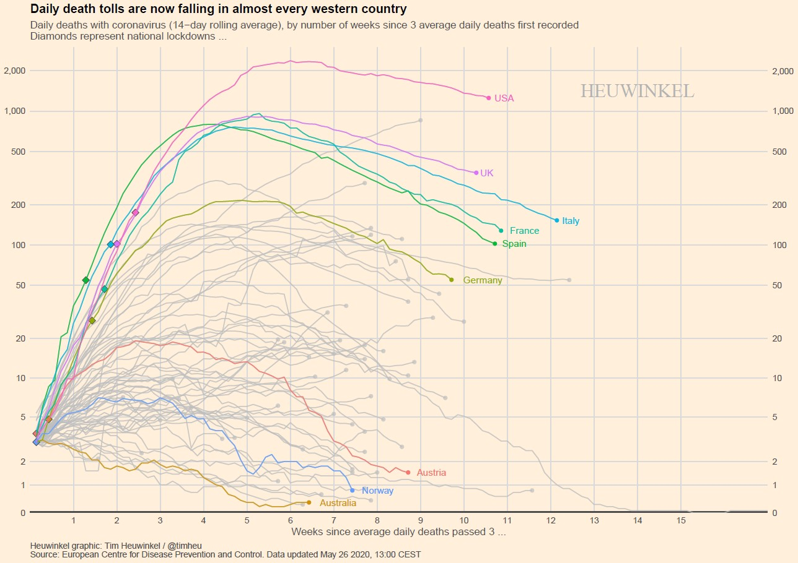
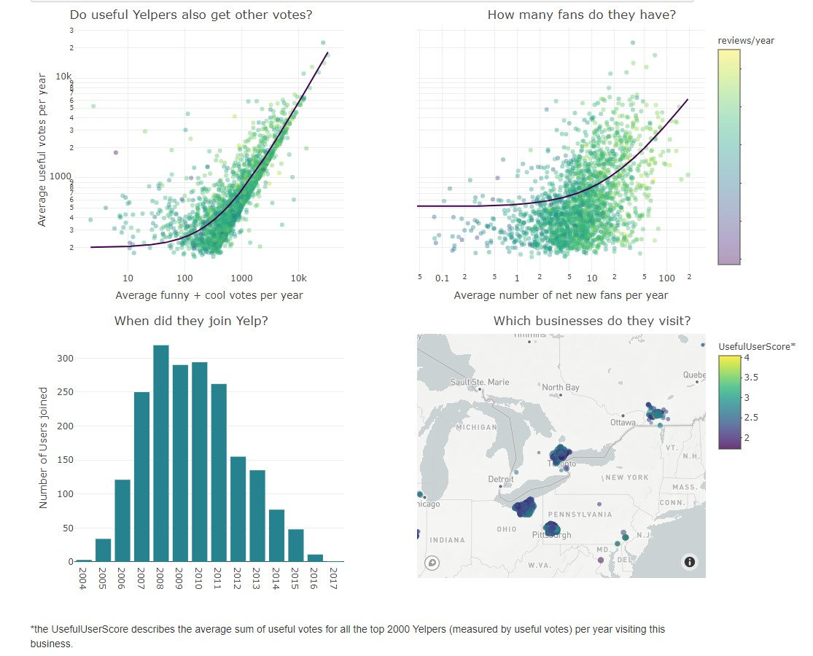
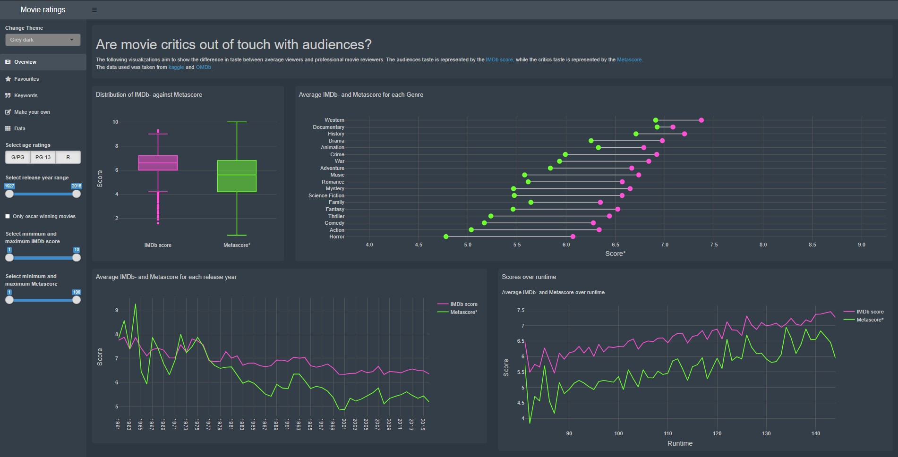

# Corona Deaths Plot

This plot helps to compare daily death tolls for different countries during the COVID-19 pandemic. Each line starts at the point in time in which the corresponding country reached 100 cases. The plot is a reproduced version with slight modifications of John Burn-Murdoch's [Coronavirus trajectory tracker plot](https://www.ft.com/video/9a72a9d4-8db1-4615-8333-4b73ae3ddff8).

# Helpful Yelpers

This visualization hopes to shed light on who the most useful Yelpers are. When did they join Yelp? Do they also get other votes? Which restaurants are most popular with useful Yelpers and what ratings do they get? All these questions can be answered by four simple plots.

# Movie Critics

Nowadays the common belief seems to be that movie critics are out of touch with the average moviegoer. To test this hypothesis the Metascore, representing the average critic, and the IMdB score, representing the average moviegoer, are stacked up against each other. The visualization is implented as a [shiny app](https://shiny.rstudio.com/) and hosted via [shinyapps.io](https://tim-heuwinkel.shinyapps.io/movie_critics/).
